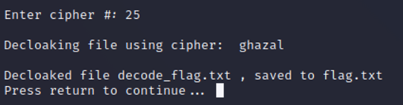

1.	For this Challenge you have given two files one is capture.pcap file and the other is the log file for the HTTPS encrypted conversation 
2.	First open the .pcap file in Wireshark and decode the HTTPS encryption using the log file provided
3.	Then export the files that were transferred during the HTTPS conversation
4.	We need two files to get the Flag one Is Ghazal file and the other is decode_flag.txt file
5.	Ghazal file is a wordlist and decode_flag.txt is the cipher text which we have to decode using the Ghazal wordlist 
6.	I used CloakifyFactory encryption technique to encrypt the flag https://github.com/TryCatchHCF/Cloakify/blob/master/README.md
7.	Clone the following Github repository and save the Ghazal file inside ciphers folder
8.	As it is a old python file you have to use python2 to execute cloakifyFactory.py on terminal
 
9.	Select 2 to Decloakify a file
 
10.	Enter the filename you want to decloakify, then filname where you want to store the decrypted file, Select n for default and enter the ghazal wordlist to decrypt the cipher

11.	As decrypted file is saved to flag.txt just cat the txt file to get the Flag

12.	Congratulations you have successfully completed the Challenge !!!

