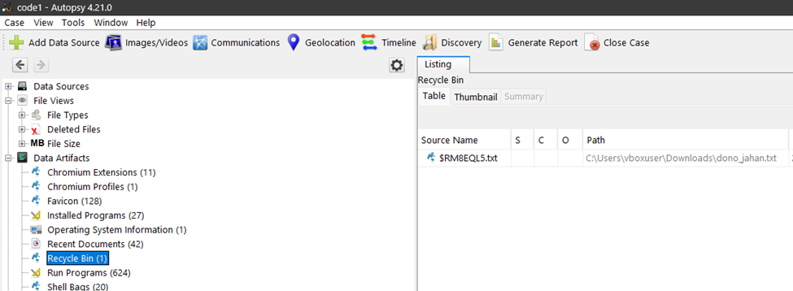
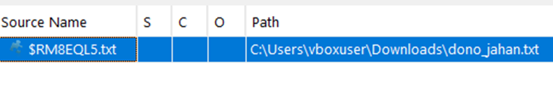
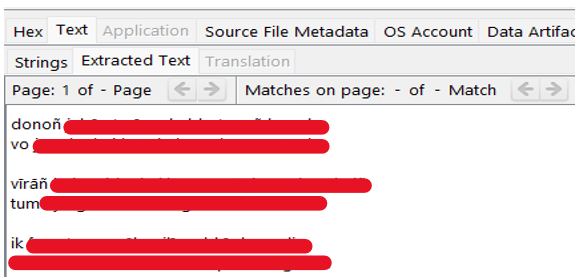
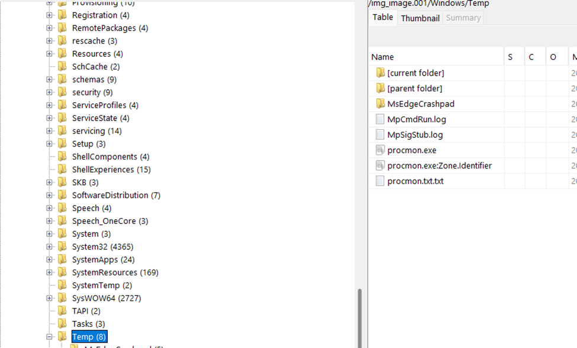
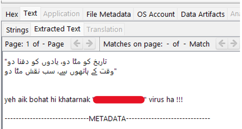

1.	First you have to download the image file from the link provided in the description of the Challenge 
2.	As the image file is corrupted it can't be mount you have to use forensics tools such as Autopsy to read the image file 
3.	There are two parts of the flag in the first part you have to recover the file which is deleted it can be found in the recycle bin 

4.	Simply google the name of the poet from this poetry you will get the first part of the flag.
5.	For the second part you have to find the malware, As most of the malware run in the tmp folder because it does not need any permission to execute any file, Just navigate to Windows/temp folder 
 
6.	You will see a number of procmon files. Procmon is an dvanced monitoring tool for Windows that shows real-time file system, Registry and process/thread activity. It’s kind of suspensions what it is doing in the temp folder
7.	Actually it is a .txt file instead of .exe file 
8.	Congratulations you have successfully completed the Challenge  !!!

